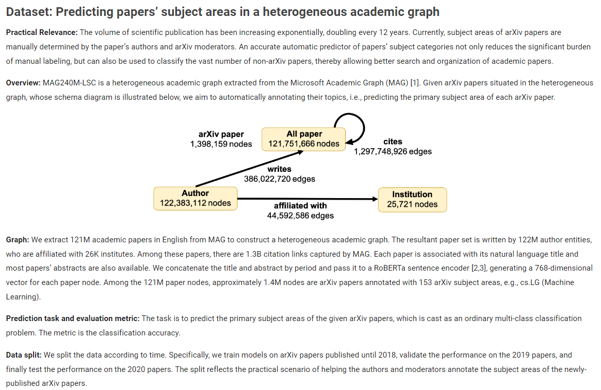

# PRODIGY-scaled

- This repo contains code accompanying the paper, [PRODIGY: Enabling In-context Learning Over Graphs](https://arxiv.org/abs/2305.12600).
- I have covered the explanation of this paper here --> [How does PRODIGY work?](https://pratzohol.github.io/MindML/Notes/Graph_Neural_Networks/icl-over-graphs-PRODIGY/).

## Overview of MAG240M dataset

- For more information, visit [OGB MAG240M dataset](https://ogb.stanford.edu/docs/lsc/mag240m/).
- The `arxiv` dataset (the labels as well) is thus, basically a subset of the `mag240m` dataset. 
